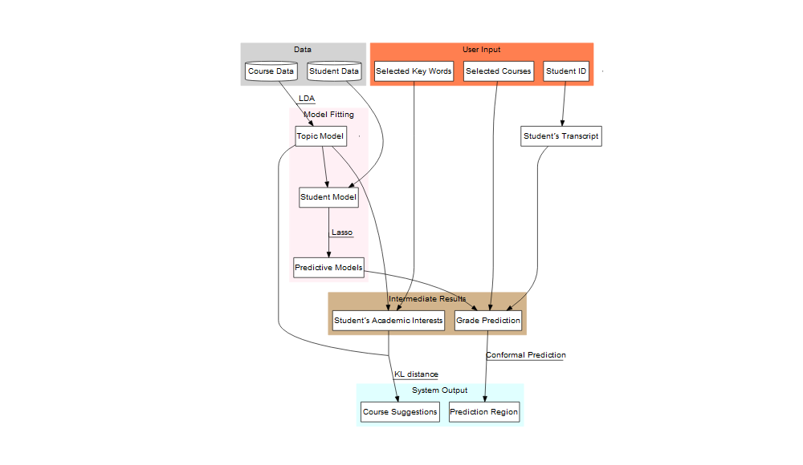
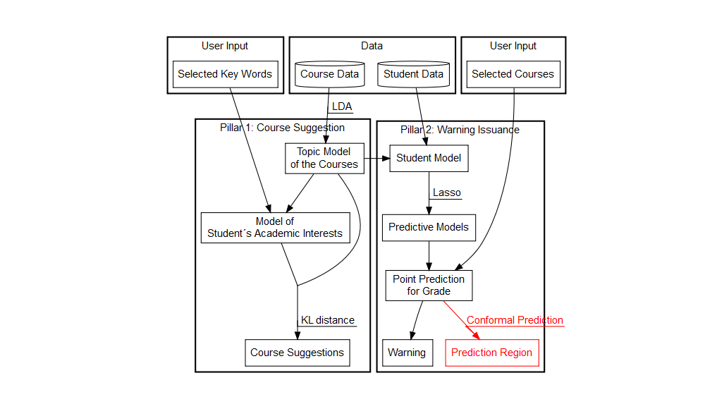
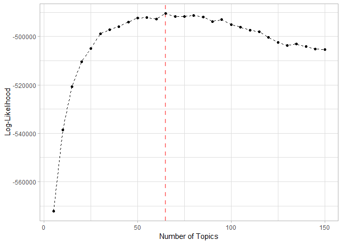
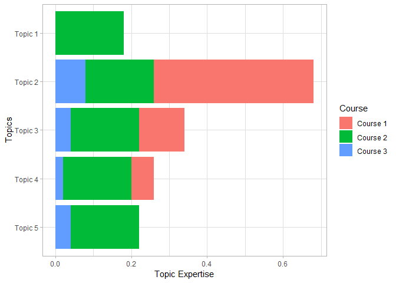
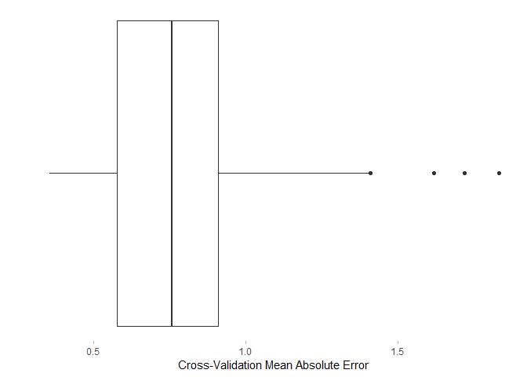
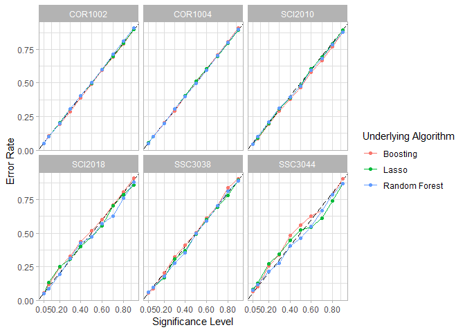
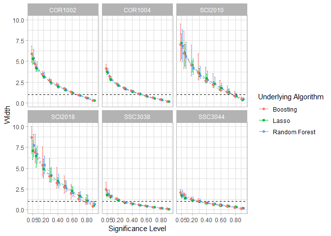
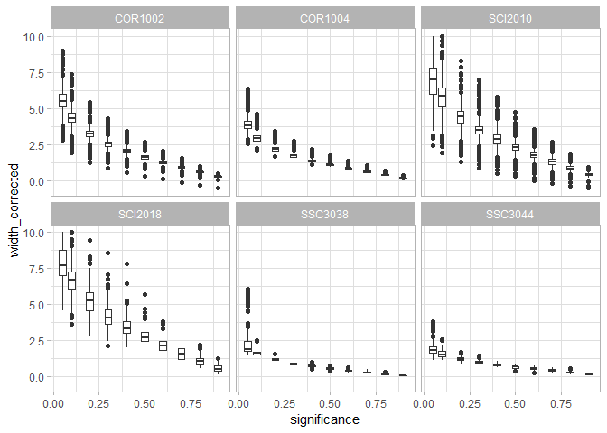

Figures for conference paper
================
DARS
2019-06-14

-   [Set up](#set-up)
-   [Student data](#student-data)
-   [Course data](#course-data)
-   [Flow chart](#flow-chart)
    -   [EDM2019 style](#edm2019-style)
    -   [2 pillar style](#pillar-style)
-   [Model Selection (topic model)](#model-selection-topic-model)
-   [Beta](#beta)
-   [Gamma](#gamma)
-   [Topic Expertise](#topic-expertise)
-   [CV](#cv)
-   [Conformal](#conformal)
    -   [course table](#course-table)
    -   [Error](#error)
    -   [width](#width)
    -   [Table](#table)

Set up
======

Student data
============

Course data
===========

Flow chart
==========

EDM2019 style
-------------

2 pillar style
--------------

Model Selection (topic model)
=============================

Beta
====

Gamma
=====

Topic Expertise
===============

CV
==

Conformal
=========

course table
------------

Error
-----

width
-----

Table
-----
